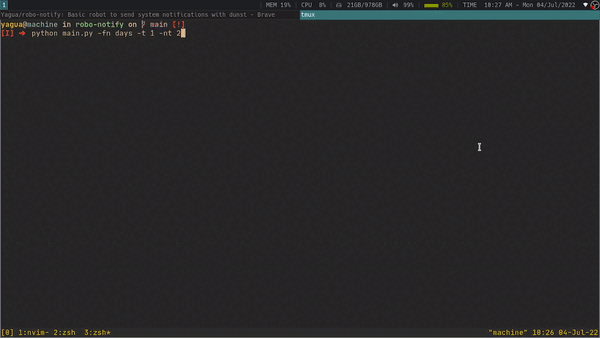

# Robo-notify

Simple robot  to perform repetitive notifications using dunst.
It is useful for tasks such as reminders or learning language
vocabulary by doing the task of memorizing this content quickly
through the aforementioned repetitions.
(still in the process of improvement).

## Requirements

- dunst
- python3+
- libnotify-bin (in ubuntu and based distros "notify-osd")

## Usage

1. clone repo
```txt
git clone https://github.com/Yagua/robo-notify
```
2. execute main script
```bash
cd robo-notify/
python3 main.py

# Recommended to make an alias with this instruction for example 'robonotify'

# in .bashrc
alias robonotify="python3 path_robo-notify/main.py"
```

## Options

| Option                                           | Description                                                            |
|--------------------------------------------------|------------------------------------------------------------------------|
| -h, --help                                       | `show this help message and exit`                                      |
| -t  TIMER, --timer TIMER                         | `time in seconds for displaying notifications (default 600s [10 min])` |
| -nt NOTIFICATIONTIME --notifitm NOTIFICATIONTIME | `time in seconds for the duration of popup notification)`              |
| -cp CUSTOMPATH, --custompath CUSTOMPATH          | `print list from a custom filepath`                                    |
| -fn FILENAME, --filename FILENAME                | `file name saved in list directory`                                    |

## Note

By default the robot has a couple of test content lists to initialize it.
It is also possible to put more lists (json files) inside the "lists"
directory of the project and initialize them with the robot by considering
the file name, or simply passing an absolute path of a file to reprocess it.

## Example of use

```bash
# considering that I put a file called 'w_sentences' in the robot's home directory
# -t 1 second time for repetitions
# -nt time of 2 seconds duration of popup notifications

robonotify -fn days -t 1 -nt 2
```
## Preview

