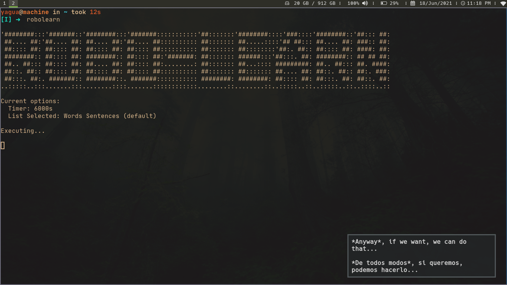

# Robo-learn
Simple robot to learn English vocabulary through repetitive notifications using dunst
(for the moment it is a personal project).

## Requirements
- dunst
- python3+

## Usage

1. clone repo
```txt
git clone https://github.com/Yagua/robo-learn
```
2. execute main script
```bash
cd robo-learn/
python3 main.py

# Recommended to make an alias with this instruction
```
The robot will execute repetitive notifications using duns.
it is possible to add new lists and options to the robot

## Preview


## Options

| Option                       | Description                                                            |
| -----------------------------| -----------------------------------------------------------------------|
| -h,  --help                  | `show this help message and exit`                                      |
| -d,  --days                  | `print the days of the week`                                           |
| -ws, --wsentences            | `print sentences with words (default)`                                 |
| -vs, --vsentences            | `print sentences with verbs`                                           |
| -ps, --psentences            | `print sentences phrasal verbs`                                        |
| -m,  --months                | `print the months of the year`                                         |
| -b,  --body                  | `print body parts`                                                     |
| -t seconds, --timer seconds  | `time in seconds for displaying notifications (default 600s [10 min])` |
